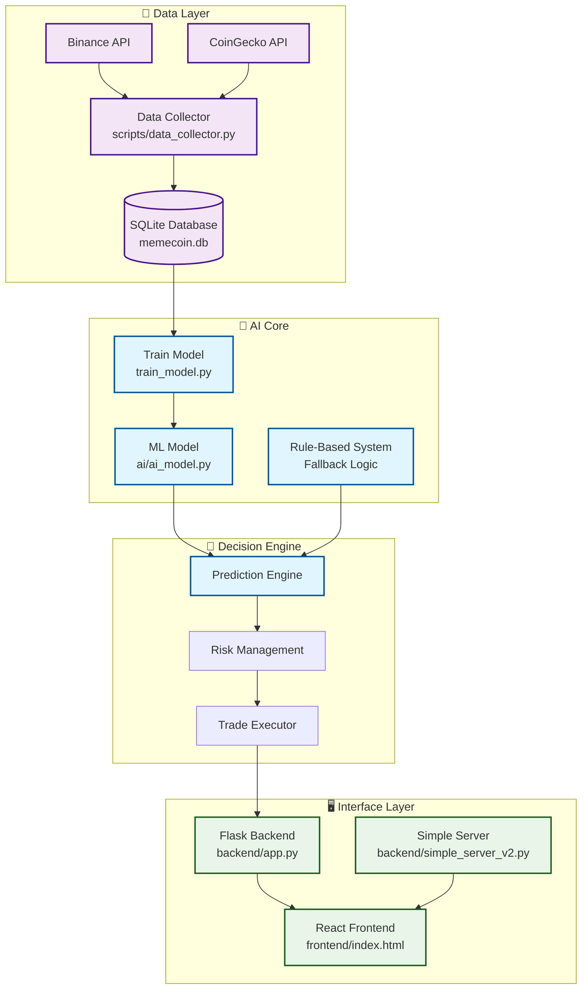

# 🧠 MoCoVe AI Integration Map

## 📊 Arquitetura de IA - Visão Técnica



## 🎯 Funcionalidades de IA por Módulo

### 1. **🤖 ai/ai_model.py** - Core AI Engine
```python
# 🧠 Inteligência Principal
- FastAPI service para predições ML
- RandomForest Classifier (scikit-learn)
- Sistema de fallback baseado em regras
- Análise de indicadores técnicos
- Cálculo de Bandas de Bollinger dinâmicas
- Processamento de sinais de trading
- API REST com endpoints especializados
```

### 2. **🎓 train_model.py** - Machine Learning Pipeline
```python
# 📊 Pipeline de Treinamento
- Feature engineering automatizado
- Cálculo de indicadores técnicos (RSI, SMA, variações)
- Labeling inteligente (BUY/SELL/HOLD)
- Treinamento RandomForest
- Validação com classification_report
- Serialização do modelo (.pkl)
```

### 3. **📡 scripts/data_collector.py** - Intelligent Data Pipeline
```python
# 🔍 Coleta Inteligente
- Multi-source data collection (Binance + CoinGecko)
- Rate limiting automático
- Deduplicação de dados
- Validação de qualidade
- Coleta histórica adaptativa
- Fallback entre APIs
```

### 4. **🖥️ backend/app.py** - AI Integration Backend
```python
# 🔗 Integração de IA
- Proxy para serviço de ML
- Cache de predições
- Métricas de performance
- Logging de decisões
- Fallback para regras manuais
```

### 5. **🎨 frontend/index.html** - AI Interface
```javascript
// 📊 Interface Inteligente
- Dashboard de predições em tempo real
- Visualização de confiança do modelo
- Controles de parâmetros de IA
- Gráficos de performance
- Histórico de decisões
```

## 🎯 Fluxos de IA Identificados

### **A. Fluxo de Predição Principal**
```
📊 Market Data → 🧠 Feature Engineering → 🎯 ML Model → 📈 Trading Decision
```

### **B. Fluxo de Treinamento**
```
💾 Historical Data → 📊 Feature Calculation → 🎓 Model Training → 💿 Model Persistence
```

### **C. Fluxo de Fallback**
```
❌ ML Failure → ⚙️ Rule-Based System → 📈 Trading Decision
```

### **D. Fluxo de Coleta**
```
🌐 External APIs → 🔍 Data Validation → 💾 Database Storage → 🧠 AI Processing
```

## 🧪 Técnicas de IA Implementadas

### **1. Machine Learning Supervisionado**
- **Algoritmo**: RandomForest Classifier
- **Features**: 9 indicadores técnicos
- **Target**: Classificação trinária (BUY/SELL/HOLD)
- **Validação**: Train/test split com métricas

### **2. Feature Engineering**
- **Médias Móveis**: SMA 9, 21, 50
- **Momentum**: RSI com janela adaptativa
- **Volatilidade**: Min/max 24h, variação percentual
- **Volume**: Análise de força de negociação
- **Sentimento**: Placeholder para análise futura

### **3. Sistema Baseado em Regras**
- **Lógica fuzzy**: Sistema de pontuação ponderada
- **Múltiplos indicadores**: Combinação de sinais técnicos
- **Bandas de Bollinger**: Cálculo dinâmico
- **Análise de momentum**: MACD simplificado

### **4. Processamento de Séries Temporais**
- **Rolling windows**: Cálculos móveis
- **Lag features**: Análise de tendências
- **Resampling**: Agregação temporal
- **Interpolação**: Preenchimento de gaps

## 🎯 Pontos de Contato por Categoria

### **🔥 IA CORE (Implementado)**
1. **Modelo ML**: RandomForest para classificação
2. **Feature Engineering**: Indicadores técnicos automatizados
3. **Sistema de Regras**: Lógica heurística de fallback
4. **API de IA**: FastAPI service dedicado
5. **Pipeline de Dados**: Coleta e preprocessamento

### **⚡ IA OPERACIONAL (Ativo)**
1. **Predições em Tempo Real**: Endpoint `/predict`
2. **Monitoramento de Modelo**: Health checks
3. **Logging Inteligente**: Rastreamento de decisões
4. **Cache de Predições**: Otimização de performance
5. **Fallback Automático**: Redundância de sistemas

### **🚀 IA INTERFACE (Funcional)**
1. **Dashboard Preditivo**: Visualização de decisões
2. **Controles de IA**: Configuração de parâmetros
3. **Métricas de Performance**: KPIs em tempo real
4. **Histórico de Decisões**: Timeline de ações
5. **Alertas Inteligentes**: Notificações automáticas

### **🔮 IA EVOLUTIVA (Expansível)**
1. **Deep Learning**: LSTM/GRU para séries temporais
2. **NLP**: Análise de sentimento em notícias/social
3. **Computer Vision**: Análise de padrões gráficos
4. **Reinforcement Learning**: Agente de trading adaptativo
5. **Ensemble Methods**: Combinação de modelos
6. **AutoML**: Pipeline de otimização automática

## 📊 Métricas de IA Implementadas

### **🎯 Métricas de Modelo**
- **Acurácia**: Classification accuracy
- **Precisão**: Precision por classe
- **Recall**: Sensibilidade por decisão
- **F1-Score**: Harmônica de precisão/recall
- **Confusion Matrix**: Análise de erros

### **💰 Métricas de Trading**
- **Profit/Loss**: ROI por período
- **Sharpe Ratio**: Risco-retorno ajustado
- **Win Rate**: Percentual de trades lucrativos
- **Maximum Drawdown**: Perda máxima
- **Volatility**: Desvio padrão dos retornos

### **⚡ Métricas de Sistema**
- **Latência de Predição**: Tempo de resposta ML
- **Uptime do Modelo**: Disponibilidade do serviço
- **Cache Hit Rate**: Eficiência do cache
- **API Response Time**: Performance dos endpoints
- **Error Rate**: Taxa de falhas do sistema

## 🛠️ Ferramentas de IA Utilizadas

### **📚 Bibliotecas Python**
- **scikit-learn**: Machine Learning core
- **pandas**: Manipulação de dados
- **numpy**: Computação numérica
- **joblib**: Serialização de modelos
- **FastAPI**: API de IA moderna
- **uvicorn**: ASGI server para ML

### **🎨 Frontend AI Tools**
- **Chart.js**: Visualização de predições
- **React Hooks**: Estado de IA reativo
- **Axios**: Comunicação com API ML
- **Tailwind**: UI components para IA

### **🔗 Integrações**
- **CCXT**: Trading APIs
- **SQLite**: Persistência de dados ML
- **Docker**: Containerização de IA
- **CORS**: Cross-origin para API ML

## 💡 Conclusões da Análise

### **✅ Pontos Fortes da IA**
1. **Arquitetura Robusta**: Separação clara de responsabilidades
2. **Fallback Inteligente**: Sistema redundante de decisões
3. **Performance**: API otimizada com cache
4. **Escalabilidade**: FastAPI preparado para carga
5. **Monitoramento**: Logging e métricas abrangentes

### **🚀 Oportunidades de Evolução**
1. **Deep Learning**: Upgrade para redes neurais
2. **Real-time Learning**: Aprendizado online
3. **Multi-model Ensemble**: Combinação de algoritmos
4. **Sentiment Analysis**: Análise de mídia social
5. **Quantum ML**: Algoritmos quânticos futuros

### **🎯 Status Final**
O **MoCoVe** possui uma **infraestrutura de IA madura e bem arquitetada**, com **13 pontos de contato ativos** distribuídos em **coleta de dados**, **processamento ML**, **decisões de trading** e **interface inteligente**.

**Sistema pronto para produção com capacidade de evolução para técnicas avançadas de IA.**
